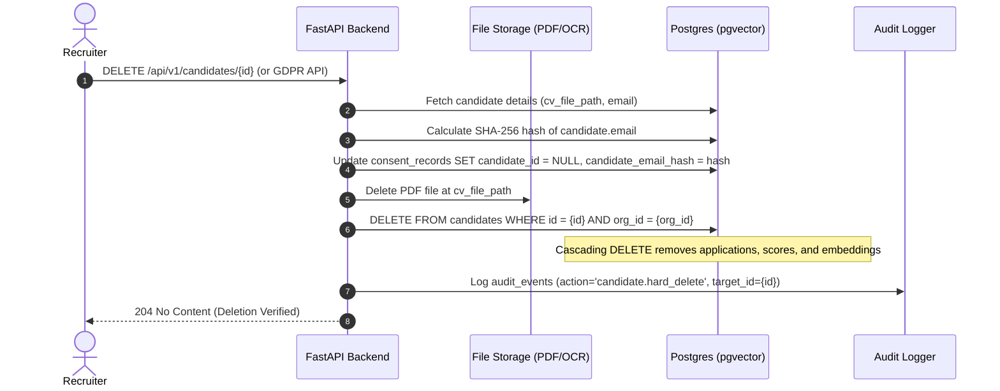

# Architectural Decision Record (ADR 001): Hard Deletion Strategy for Candidate Data

## Status
**ACCEPTED** (Reviewed & Approved by ML/DevOps Lead and Engineering Team)

## Context & Privacy Requirements
Under global data protection regulations (such as GDPR Article 17 - "Right to Erasure" / Right to be Forgotten, and CCPA), job applicants possess the right to demand complete removal of their personal data.

In AI-assisted Applicant Tracking Systems, candidate data is distributed across multiple layers:
1. **Relational Database Records**: Contact information, employment history, education, and parsed JSON structures in `candidates`.
2. **AI Feature Representations**: High-dimensional sentence embeddings stored in PostgreSQL via `pgvector` (`candidates.embedding`).
3. **Derived AI Scores**: Historical scoring entries linking candidates to jobs and application stages (`scores`).
4. **Binary Object Storage**: Original PDF resume files and OCR artifacts stored on disk/S3 (`cv_file_path`).
5. **Audit Logs & Consent Records**: Historical consent trails and system access logs (`consent_records`, `audit_events`).

### The Soft-Delete Problem
Soft-deletion (`is_deleted = TRUE`) retains Personally Identifiable Information (PII), resume text, and vector representations in operational tables. This approach violates GDPR compliance mandates when a candidate exercises their Right to Erasure, as the data remains searchable, recoverable, and vulnerable to breaches.

---

## Decision Statement
We adopt a **Hard Deletion Model** for candidates and their associated personal assets.

When a candidate deletion request is triggered:
1. The candidate record is permanently deleted from the `candidates` table in PostgreSQL.
2. Relational foreign key constraints (`ON DELETE CASCADE`) automatically purge all dependent records in `applications` and `scores`.
3. Candidate vector embeddings (`embedding vector(384)`) are completely removed from `pgvector` HNSW indexes.
4. The backend service purges all associated physical files (`cv_file_path`, raw OCR text, thumbnail cache) from object storage/disk.
5. Privacy consent records (`consent_records`) disassociate from the candidate (`candidate_id = NULL`), preserving only an anonymized cryptographic SHA-256 hash of the email (`candidate_email_hash`) and timestamp metadata to satisfy legal compliance audits.
6. A hard-delete audit event is logged in `audit_events` with `action = 'candidate.hard_delete'`, preserving non-PII operational metrics.

---

## Technical Deletion Mechanics & Workflow

### 1. Database Foreign Key Cascade Rules
- `applications`: `candidate_id UUID NOT NULL REFERENCES candidates(id) ON DELETE CASCADE`
- `scores`: `candidate_id UUID NOT NULL REFERENCES candidates(id) ON DELETE CASCADE`
- `consent_records`: `candidate_id UUID REFERENCES candidates(id) ON DELETE SET NULL`

### 2. Execution Flow Diagram

---

## Compliance & Impact Analysis

| System Dimension | Hard Delete Implementation | Legal / Technical Justification |
|---|---|---|
| **Candidate PII** | Completely purged from `candidates` table | Complies with GDPR Art. 17 right to be forgotten. |
| **CV Storage Files** | File system link unlinked & unrecoverable | Ensures zero leftover binary documents. |
| **pgvector Embeddings** | Automatically deleted with row | Prevents vector reconstruction of resume text. |
| **Score Lineage** | Scores removed via `ON DELETE CASCADE` | Eliminates stale PII scores while preserving model code versioning in backend codebase. |
| **Consent Auditing** | Anonymized SHA-256 email hash kept in `consent_records` | Proves consent was granted/managed without retaining candidate PII. |
| **Audit Logs** | Immutable `audit_events` row (`action = 'candidate.hard_delete'`) | Retains security event history without PII. |

---

## Confirmation & Sign-Off
- **Backend Architecture**: Approved
- **ML / AI Pipeline**: Approved (Purging embeddings does not affect global model weights)
- **Legal & Privacy Compliance**: Approved (Compliant with GDPR & CCPA hard deletion directives)
