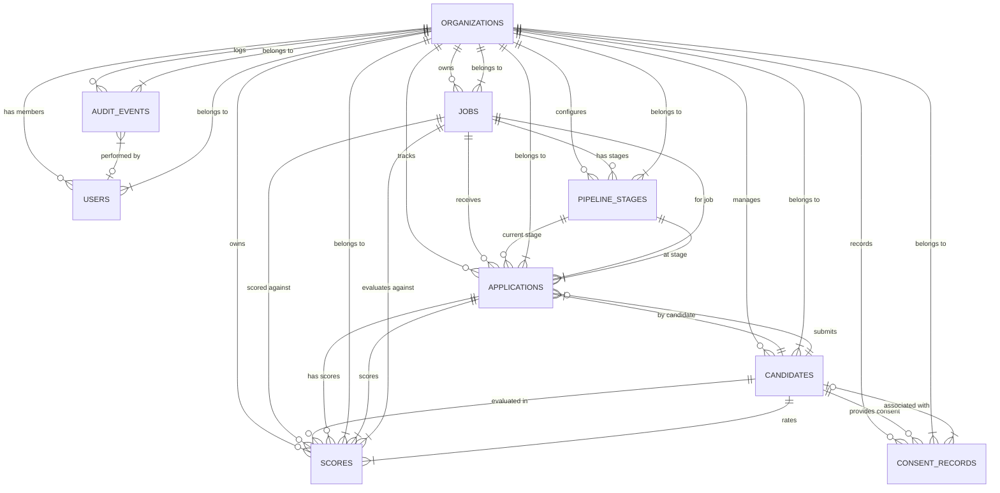

# Database Entity-Relationship Diagram (ERD) & Schema Documentation

## Executive Overview
This document defines the relational database architecture for the multi-tenant, AI-assisted Applicant Tracking System (ATS). The schema is designed for PostgreSQL 17 with `pgvector`, optimized for isolation, AI-assisted scoring, fairness audits, and GDPR compliance.

### Core Architecture Design Principles
1. **Multi-Tenancy (`org_id`) Isolation**:
   - Every tenant data table strictly contains `org_id UUID REFERENCES organizations(id) ON DELETE CASCADE`.
   - All primary composite indexes start with `org_id` to enforce scoped index lookup performance and facilitate Row Level Security (RLS) policies.
2. **Hybrid AI Scoring & Model Lineage**:
   - The `scores` table captures both component sub-scores (skill overlap, semantic similarity, experience, title fit) and overall score.
   - The `model_version` column records exact model provenance for auditability and A/B evaluation against baseline models.
   - The `component_breakdown` column (`JSONB`) stores detailed structured explanations (matched/missing skills, confidence levels, feature weights).
3. **Hard Deletion & Privacy Compliance**:
   - Candidate deletion executes a strict **hard delete** (`ON DELETE CASCADE` across `applications`, `scores`, and vector embeddings).
   - Physical CV files are purged from file storage.
   - Consent records retain a cryptographic SHA-256 hash of candidate emails (`candidate_email_hash`) and set `candidate_id` to `NULL` to preserve legal processing compliance without storing Personally Identifiable Information (PII).

---

## Mermaid Entity-Relationship Diagram



---

## Detailed Data Dictionary

### 1. `organizations` (Tenants)
Represents customer organizations / workspace tenants.

| Column | Type | Constraints | Description |
|---|---|---|---|
| `id` | UUID | PRIMARY KEY, `gen_random_uuid()` | Unique tenant identifier |
| `name` | VARCHAR(255) | NOT NULL | Organization workspace name |
| `slug` | VARCHAR(100) | NOT NULL, UNIQUE | Unique URL slug for workspace routing |
| `created_at` | TIMESTAMPTZ | NOT NULL, DEFAULT `NOW()` | Timestamp of creation |
| `updated_at` | TIMESTAMPTZ | NOT NULL, DEFAULT `NOW()` | Timestamp of last update |

### 2. `users` (Users & Roles)
System users assigned to organizations with role-based permissions (`admin`, `recruiter`, `viewer`).

| Column | Type | Constraints | Description |
|---|---|---|---|
| `id` | UUID | PRIMARY KEY, `gen_random_uuid()` | Unique user identifier |
| `org_id` | UUID | NOT NULL, FK -> `organizations(id)` CASCADE | Tenant workspace owner |
| `email` | VARCHAR(255) | NOT NULL | User login email |
| `hashed_password` | VARCHAR(255) | NOT NULL | Argon2 / bcrypt hashed password |
| `full_name` | VARCHAR(255) | NOT NULL | User's full display name |
| `role` | VARCHAR(50) | NOT NULL, CHECK IN (`admin`, `recruiter`, `viewer`) | Role-based permission level |
| `is_active` | BOOLEAN | NOT NULL, DEFAULT `TRUE` | User account status |
| `created_at` | TIMESTAMPTZ | NOT NULL, DEFAULT `NOW()` | Timestamp of registration |
| `updated_at` | TIMESTAMPTZ | NOT NULL, DEFAULT `NOW()` | Timestamp of last update |

*Unique Constraint*: `(org_id, email)`

### 3. `jobs`
Job postings created by recruiters within an organization workspace.

| Column | Type | Constraints | Description |
|---|---|---|---|
| `id` | UUID | PRIMARY KEY, `gen_random_uuid()` | Unique job identifier |
| `org_id` | UUID | NOT NULL, FK -> `organizations(id)` CASCADE | Tenant workspace owner |
| `title` | VARCHAR(255) | NOT NULL | Job position title |
| `department` | VARCHAR(100) | NULLABLE | Department name |
| `location` | VARCHAR(100) | NULLABLE | Workplace location / remote status |
| `employment_type` | VARCHAR(50) | DEFAULT `'full_time'` | Type (full_time, part_time, contract) |
| `status` | VARCHAR(50) | NOT NULL, DEFAULT `'draft'`, CHECK IN (`draft`, `open`, `paused`, `closed`, `archived`) | Posting status lifecycle |
| `description` | TEXT | NOT NULL | Complete job posting text & requirements |
| `required_skills` | JSONB | NOT NULL, DEFAULT `'[]'` | Array of required ESCO skills |
| `preferred_skills` | JSONB | NOT NULL, DEFAULT `'[]'` | Array of nice-to-have ESCO skills |
| `min_experience_years` | INT | NOT NULL, DEFAULT `0` | Minimum work experience required |
| `embedding` | `vector(384)` | NULLABLE | 384-dimensional sentence transformer embedding |
| `created_by` | UUID | FK -> `users(id)` SET NULL | Recruiter user who posted job |
| `created_at` | TIMESTAMPTZ | NOT NULL, DEFAULT `NOW()` | Creation timestamp |
| `updated_at` | TIMESTAMPTZ | NOT NULL, DEFAULT `NOW()` | Last update timestamp |

### 4. `pipeline_stages`
Customizable hiring pipeline stages (e.g. Applied -> Screening -> Interview -> Offer -> Hired/Rejected).

| Column | Type | Constraints | Description |
|---|---|---|---|
| `id` | UUID | PRIMARY KEY, `gen_random_uuid()` | Stage identifier |
| `org_id` | UUID | NOT NULL, FK -> `organizations(id)` CASCADE | Tenant workspace owner |
| `job_id` | UUID | NULLABLE, FK -> `jobs(id)` CASCADE | Job specific stage (NULL = org default) |
| `name` | VARCHAR(100) | NOT NULL | Human-readable stage name |
| `stage_order` | INT | NOT NULL | Sequence index for drag-and-drop pipeline |
| `stage_type` | VARCHAR(50) | NOT NULL, DEFAULT `'custom'`, CHECK IN (`applied`, `screening`, `interview`, `offer`, `hired`, `rejected`, `custom`) | Standard pipeline semantic type |
| `created_at` | TIMESTAMPTZ | NOT NULL, DEFAULT `NOW()` | Creation timestamp |
| `updated_at` | TIMESTAMPTZ | NOT NULL, DEFAULT `NOW()` | Last update timestamp |

*Unique Constraint*: `(org_id, job_id, stage_order)`

### 5. `candidates`
Candidate records storing parsed CV text, structured extraction, vector embeddings, and demographic redaction flags.

| Column | Type | Constraints | Description |
|---|---|---|---|
| `id` | UUID | PRIMARY KEY, `gen_random_uuid()` | Candidate identifier |
| `org_id` | UUID | NOT NULL, FK -> `organizations(id)` CASCADE | Tenant workspace owner |
| `full_name` | VARCHAR(255) | NOT NULL | Candidate full name |
| `email` | VARCHAR(255) | NOT NULL | Primary contact email |
| `phone` | VARCHAR(50) | NULLABLE | Contact telephone |
| `location` | VARCHAR(255) | NULLABLE | Candidate address/city |
| `cv_file_path` | TEXT | NULLABLE | Path to original PDF file on storage |
| `raw_text` | TEXT | NULLABLE | Parsed resume text (via PyMuPDF / Tesseract) |
| `parsed_data` | JSONB | NOT NULL, DEFAULT `'{}'` | Extracted skills, work history, education, OCR flags |
| `embedding` | `vector(384)` | NULLABLE | Resume semantic embedding vector |
| `protected_attributes` | JSONB | NOT NULL, DEFAULT `'{}'` | Redacted demographic attributes for fairness audit |
| `is_anonymized` | BOOLEAN | NOT NULL, DEFAULT `FALSE` | Flag indicating if PII has been redacted |
| `created_at` | TIMESTAMPTZ | NOT NULL, DEFAULT `NOW()` | Resume upload timestamp |
| `updated_at` | TIMESTAMPTZ | NOT NULL, DEFAULT `NOW()` | Last modification timestamp |

*Unique Constraint*: `(org_id, email)`

### 6. `applications`
Join entity linking candidates to jobs and tracking their current pipeline stage.

| Column | Type | Constraints | Description |
|---|---|---|---|
| `id` | UUID | PRIMARY KEY, `gen_random_uuid()` | Application identifier |
| `org_id` | UUID | NOT NULL, FK -> `organizations(id)` CASCADE | Tenant workspace owner |
| `job_id` | UUID | NOT NULL, FK -> `jobs(id)` CASCADE | Associated job posting |
| `candidate_id` | UUID | NOT NULL, FK -> `candidates(id)` CASCADE | Candidate applicant |
| `stage_id` | UUID | NOT NULL, FK -> `pipeline_stages(id)` RESTRICT | Current hiring pipeline stage |
| `status` | VARCHAR(50) | NOT NULL, DEFAULT `'active'`, CHECK IN (`active`, `hired`, `rejected`, `withdrawn`) | Overall application state |
| `rejection_reason` | TEXT | NULLABLE | Recruiter provided rejection feedback |
| `applied_at` | TIMESTAMPTZ | NOT NULL, DEFAULT `NOW()` | Application submission timestamp |
| `updated_at` | TIMESTAMPTZ | NOT NULL, DEFAULT `NOW()` | Last stage update timestamp |

*Unique Constraint*: `(org_id, job_id, candidate_id)`

### 7. `scores`
Hybrid AI score rankings generated for candidate applications against job requirements.

| Column | Type | Constraints | Description |
|---|---|---|---|
| `id` | UUID | PRIMARY KEY, `gen_random_uuid()` | Score record identifier |
| `org_id` | UUID | NOT NULL, FK -> `organizations(id)` CASCADE | Tenant workspace owner |
| `application_id` | UUID | NOT NULL, FK -> `applications(id)` CASCADE | Target application |
| `job_id` | UUID | NOT NULL, FK -> `jobs(id)` CASCADE | Reference job posting |
| `candidate_id` | UUID | NOT NULL, FK -> `candidates(id)` CASCADE | Scored candidate |
| `overall_score` | NUMERIC(5,2) | NOT NULL, CHECK (0 to 100) | Final weighted composite fit score |
| `skill_overlap_score` | NUMERIC(5,2) | NOT NULL, CHECK (0 to 100) | ESCO skill taxonomy match score |
| `semantic_score` | NUMERIC(5,2) | NOT NULL, CHECK (0 to 100) | Vector cosine similarity score |
| `experience_score` | NUMERIC(5,2) | NOT NULL, CHECK (0 to 100) | Experience depth & title match score |
| `title_fit_score` | NUMERIC(5,2) | NOT NULL, CHECK (0 to 100) | Job title hierarchy match score |
| `model_version` | VARCHAR(50) | NOT NULL | Algorithm identifier e.g., `v1.0.0-baseline-cpu` |
| `component_breakdown` | JSONB | NOT NULL, DEFAULT `'{}'` | JSON store for matched/missing skills, weightings, & explanations |
| `calculated_at` | TIMESTAMPTZ | NOT NULL, DEFAULT `NOW()` | Scoring calculation timestamp |

*Unique Constraint*: `(application_id, model_version)`

#### `component_breakdown` JSON Structure Example
```json
{
  "matched_skills": ["Python", "FastAPI", "PostgreSQL", "PyTorch"],
  "missing_skills": ["Redis", "Docker"],
  "skill_match_percentage": 66.7,
  "experience_years_found": 4.5,
  "experience_years_required": 3.0,
  "weights": {
    "skill_overlap": 0.40,
    "semantic": 0.30,
    "experience": 0.20,
    "title_fit": 0.10
  },
  "score_explanations": [
    "Candidate possesses 4 out of 6 required ESCO skills.",
    "Resume embedding vector similarity with job description: 0.82.",
    "Candidate has 4.5 years relevant experience (exceeds requirement of 3 years)."
  ]
}
```

### 8. `audit_events`
Immutable log of recruiter interactions, scoring runs, stage movements, and hard-delete operations. Used for training learned rankers and legal auditing.

| Column | Type | Constraints | Description |
|---|---|---|---|
| `id` | UUID | PRIMARY KEY, `gen_random_uuid()` | Audit event identifier |
| `org_id` | UUID | NOT NULL, FK -> `organizations(id)` CASCADE | Tenant workspace owner |
| `user_id` | UUID | NULLABLE, FK -> `users(id)` SET NULL | User who executed action (NULL = System) |
| `action` | VARCHAR(100) | NOT NULL | Event name e.g., `candidate.hard_delete`, `recruiter.override` |
| `target_entity` | VARCHAR(50) | NOT NULL | Entity type (`candidate`, `job`, `application`, `score`) |
| `target_id` | UUID | NULLABLE | ID of impacted record |
| `details` | JSONB | NOT NULL, DEFAULT `'{}'` | Event metadata, delta payload, IP, user-agent |
| `ip_address` | VARCHAR(45) | NULLABLE | Client IPv4/IPv6 address |
| `user_agent` | TEXT | NULLABLE | Browser/Client user agent string |
| `created_at` | TIMESTAMPTZ | NOT NULL, DEFAULT `NOW()` | Event timestamp |

### 9. `consent_records`
GDPR / Privacy compliance consent tracking for candidate data processing and AI scoring.

| Column | Type | Constraints | Description |
|---|---|---|---|
| `id` | UUID | PRIMARY KEY, `gen_random_uuid()` | Consent record identifier |
| `org_id` | UUID | NOT NULL, FK -> `organizations(id)` CASCADE | Tenant workspace owner |
| `candidate_id` | UUID | NULLABLE, FK -> `candidates(id)` SET NULL | Candidate record (SET NULL on hard delete) |
| `candidate_email_hash` | VARCHAR(64) | NOT NULL | Cryptographic SHA-256 hash of email |
| `consent_type` | VARCHAR(50) | NOT NULL, DEFAULT `'data_processing'` | Scope (`data_processing`, `ai_scoring`) |
| `status` | VARCHAR(20) | NOT NULL, CHECK IN (`granted`, `revoked`, `expired`) | State of consent |
| `granted_at` | TIMESTAMPTZ | NOT NULL, DEFAULT `NOW()` | Consent timestamp |
| `revoked_at` | TIMESTAMPTZ | NULLABLE | Revocation timestamp |
| `ip_address` | VARCHAR(45) | NULLABLE | Client IP at opt-in |
| `user_agent` | TEXT | NULLABLE | Client user agent at opt-in |
| `notes` | TEXT | NULLABLE | Additional privacy notes |
| `created_at` | TIMESTAMPTZ | NOT NULL, DEFAULT `NOW()` | Creation timestamp |

---

## Indexing Strategy

### Multi-Tenant & Query Indexes
- `idx_users_org_role`: `users(org_id, role)` - Fast lookup of org recruiters/admins.
- `idx_jobs_org_status`: `jobs(org_id, status)` - Filtering active job listings per workspace.
- `idx_pipeline_stages_org_job`: `pipeline_stages(org_id, job_id, stage_order)` - Ordering pipeline board stages.
- `idx_candidates_org_email`: `candidates(org_id, email)` - Fast candidate deduplication and search.
- `idx_applications_org_job_stage`: `applications(org_id, job_id, stage_id)` - KanBan board stage column rendering.
- `idx_scores_org_job_score`: `scores(org_id, job_id, overall_score DESC)` - High-performance candidate ranking retrieval.

### AI Search & Vector Indexing
- `idx_candidates_embedding_hnsw`: `candidates USING hnsw (embedding vector_cosine_ops)` - Hierarchical Navigable Small World index for fast approximate nearest-neighbor vector similarity ("find similar candidates").
- `idx_jobs_embedding_hnsw`: `jobs USING hnsw (embedding vector_cosine_ops)` - Vector search across job description embeddings.

### JSONB GIN Indexes
- `idx_jobs_required_skills_gin`: `jobs USING gin (required_skills)` - Fast query filtering by required skills.
- `idx_candidates_parsed_data_gin`: `candidates USING gin (parsed_data)` - Deep query matching inside candidate JSON parsed data.
- `idx_scores_component_breakdown_gin`: `scores USING gin (component_breakdown)` - Analytics and fairness audit query filtering.
