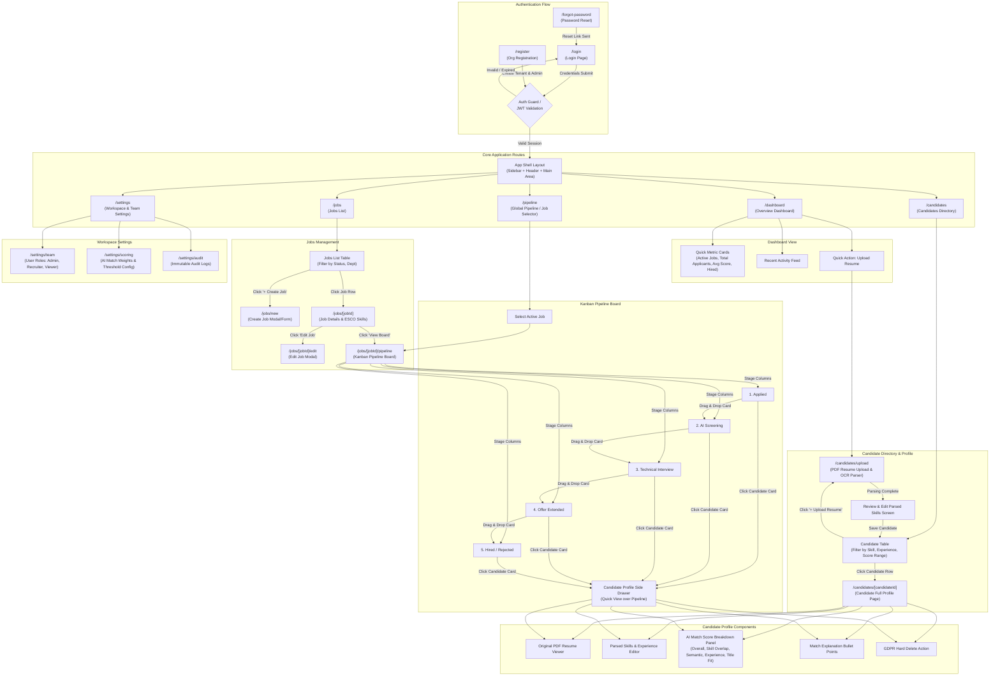

# ATS UI Wireframes & Architecture Blueprint (Phase 1)

## Executive Overview
This document specifies the low-fidelity UI/UX architecture and structural wireframes for the AI-assisted Applicant Tracking System (ATS). It contains:
1. **Complete Navigation Map** (Mermaid.js flowchart detailing authentication flows, core routes, modals, side-drawers, and stage transitions).
2. **App Shell Structural Blueprint** (Layout design, Header, Sidebar, Dynamic Main View, and UI Component Inventory).

---

## 1. Complete Navigation Map



---

## 2. App Shell Structural Blueprint

### 2.1 Layout Architecture & Grid Structure
The application shell utilizes a modern **responsive 2-column layout** with a fixed/collapsible left sidebar, a sticky top header bar, and a dynamic main content viewport.

```
+----------------------------------------------------------------------------------------------------+
|  [Sidebar Logo]    [Breadcrumbs: Dashboard > Senior Backend > Pipeline]  (Search) [+Add] [🔔] [Avatar] |  <- Top Header (Sticky)
+------------------+---------------------------------------------------------------------------------+
|                  |                                                                                 |
|  🏢 Workspace    |  [Page Title: Pipeline Board]               [Filter] [Sort] [+ Candidate]       |  <- Page Action Bar
|                  | ------------------------------------------------------------------------------- |
|  ----------------|                                                                                 |
|  📊 Dashboard    |  +----------------+  +----------------+  +----------------+  +----------------+ |
|  💼 Jobs         |  | APPLIED (12)   |  | SCREENING (5)  |  | INTERVIEW (3)  |  | OFFER (1)      | |  <- Main Content View
|  👥 Candidates   |  |                |  |                |  |                |  |                | |     (e.g., Kanban,
|  🔀 Pipeline     |  | [Card 1: 92%]  |  | [Card 4: 88%]  |  | [Card 6: 95%]  |  | [Card 7: 91%]  | |      Table, or
|  ----------------|  | [Card 2: 85%]  |  | [Card 5: 79%]  |  |                |  |                | |      Form Views)
|  ⚙️ Settings      |  | [Card 3: 74%]  |  |                |  |                |  |                | |
|                  |  +----------------+  +----------------+  +----------------+  +----------------+ |
|                  |                                                                                 |
|  [Collapse <]    |                                                                                 |
|  [User Info]     |                                                                                 |
+------------------+---------------------------------------------------------------------------------+
```

---

### 2.2 Section Breakdown & Specifications

#### 1. Collapsible Left Sidebar (`Sidebar`)
- **Brand / Organization Switcher (`OrgSwitcher`)**:
  - Displays current organization name & logo.
  - Dropdown menu allowing admins to switch between active tenant workspaces.
- **Main Navigation Group (`NavGroup`)**:
  - `Dashboard`: Links to `/dashboard` (Icon: `LayoutDashboard`).
  - `Jobs`: Links to `/jobs` with active job count badge (Icon: `Briefcase`).
  - `Candidates`: Links to `/candidates` with total applicant count (Icon: `Users`).
  - `Pipeline`: Links to `/pipeline` (Icon: `Kanban`).
  - `Settings`: Links to `/settings` (Icon: `Settings`).
- **Sidebar Footer (`SidebarFooter`)**:
  - Collapse / Expand toggle button (Keyboard shortcut: `Ctrl + \`).
  - Current user pill: Avatar, Name, Role Badge (`Admin`, `Recruiter`, `Viewer`).

#### 2. Sticky Top Header (`Header`)
- **Left Region**:
  - `SidebarTrigger`: Toggle sidebar visibility on mobile and desktop.
  - `Breadcrumbs`: Dynamic navigation hierarchy (e.g. `Jobs` > `Senior Backend Engineer` > `Pipeline Board`).
- **Center Region**:
  - `GlobalSearch`: Command palette trigger (`CommandMenu`) with shortcut hint `Ctrl + K` / `Cmd + K`. Opens instant fuzzy search overlay across candidates, job postings, and parsed skills.
- **Right Region**:
  - `QuickActionMenu`: Dropdown button for primary creation triggers:
    - `+ Upload Resume` (Opens `CVUploadDialog`)
    - `+ Create Job` (Opens `JobFormModal`)
  - `NotificationBell`: Trigger for notification popover (new CV parsing completed, score threshold reached, candidate moved stage).
  - `UserDropdown`: Profile settings, theme switcher (Light/Dark mode), system documentation, and Sign Out action.

#### 3. Main Content Viewport (`MainViewport`)
- **Page Action Header (`PageHeader`)**:
  - Title, subtitle / metadata (e.g. "Senior Backend Engineer • Created 2 days ago").
  - Contextual action bar: Stage search filter, candidate score threshold slider (0-100%), Export button, and View toggle (Kanban Board vs. List Table).
- **Dynamic Content Region**:
  - Renders route-specific views (`/dashboard`, `/jobs`, `/candidates`, `/pipeline`).
- **Overlay Layer**:
  - `CandidateDrawer`: Slide-over panel (right side) that overlays the pipeline when clicking a candidate card, keeping Kanban context intact.
  - `GlobalModalProvider`: Container for upload modals, job creation dialogs, and delete confirmations.

---

### 2.3 Complete UI Component Inventory (Drawing Checklist)

| Component Name | Base Library (shadcn/ui) | Purpose / UI Description |
|---|---|---|
| **AppLayout** | Custom Grid/Flex | Root wrapper providing 2-column layout & overlay container |
| **Sidebar** | `Sidebar` | Fixed left navigation container with collapse state |
| **OrgSwitcher** | `DropdownMenu`, `Button` | Workspace selection dropdown with tenant logo |
| **NavItem** | `Button`, `Badge` | Nav link item with active state indicator and count badge |
| **SidebarToggle** | `Button` | Icon button to collapse/expand sidebar |
| **Header** | Custom Sticky Bar | Top header bar containing search, quick actions, & profile |
| **BreadcrumbNav** | `Breadcrumb` | Hierarchical route location tracker |
| **GlobalSearch** | `Command` (CMDK) | Palette dialog for searching candidates, jobs, and skills |
| **QuickActionSplit** | `DropdownMenu`, `Button` | Primary action split-button (`+ Upload Resume`, `+ Create Job`) |
| **NotificationPopover** | `Popover`, `ScrollArea` | Unread notifications list with status tags |
| **UserMenu** | `DropdownMenu`, `Avatar` | Profile avatar dropdown with role badge & logout action |
| **PageHeader** | Custom Component | Page title, description, and primary page actions |
| **MetricsCard** | `Card` | Overview statistics card with trend indicator badge |
| **KanbanBoard** | Custom DND Container | Multi-column drag-and-drop pipeline board |
| **KanbanColumn** | `Card` | Stage column header with application count & stage actions |
| **CandidateCard** | `Card`, `Badge` | Candidate preview card displaying name, ATS score badge, and top skills |
| **CandidateDrawer** | `Sheet` (Slide-over) | Candidate profile overview, PDF viewer, & score breakdown panel |
| **PDFViewer** | Custom Iframe/Canvas | Interactive PDF resume viewer with highlight & search |
| **ScoreBreakdown** | `Progress`, `Accordion` | Score breakdown gauges (Skill match, Semantic, Experience, Title fit) |
| **CVUploadDialog** | `Dialog`, `Progress` | Drag-and-drop PDF dropzone with real-time OCR parsing progress |
| **ParsedSkillBadge** | `Badge` | Interactive skill tag (green = matched, red = missing, gray = extra) |
| **JobFormModal** | `Dialog`, `Tabs` | Multi-step form for creating job requirements and ESCO skills |
| **ConfirmDeleteDialog**| `AlertDialog` | Confirmation modal for GDPR Right-to-Erasure candidate hard delete |

---

## 3. Phase 2 Screen Wireframe Specifications

### 3.1 Screen 1: Login & Register Screens

#### A. Login Screen (`/login`)
- **Layout Architecture**: Centered single-column Auth Card container (`Card` width ~420px) on a subtle grid background with top brand logo.
- **Visual Blueprint**:
```
+------------------------------------------------------------------+
|                          [ ATS Logo ]                            |
|                     Welcome back to ATS Scorer                   |
|              Sign in to access your recruiter workspace           |
|                                                                  |
| +--------------------------------------------------------------+ |
| | [!] Invalid email or password. Please check credentials.     | | <- Destructive Alert (Error State)
| +--------------------------------------------------------------+ |
|                                                                  |
| Email Address*                                                   |
| [ recruiter@acme.com                                         ]   |
|                                                                  |
| Password*                                           Forgot?      |
| [ •••••••••••••••••••••••••                            (👁️) ]   |
|                                                                  |
| [X] Remember this device for 30 days                             |
|                                                                  |
| [                  Sign In to Workspace                      ]   | <- Primary Button
|                                                                  |
| Don't have an account? [ Register your Organization ]           |
+------------------------------------------------------------------+
```
- **Inputs & Field Specs**:
  - `email`: `Input` (type `email`, required, autofocus). Validation text: "Please enter a valid email address."
  - `password`: `Input` (type `password`, required, right adornment show/hide password toggle `Eye` / `EyeOff`).
  - `remember_me`: `Checkbox` with label "Remember this device for 30 days".
- **Buttons**:
  - `Sign In`: `Button` (Variant `default`, size `lg`, full width). State: Default / Hover / Active / Disabled (when inputs empty) / Loading (shows `Loader2` spinner icon & text "Signing in...").
  - `Forgot Password`: `Button` (Variant `link`, size `sm`). Navigates to `/forgot-password`.
  - `Register Link`: `Button` (Variant `link`). Navigates to `/register`.
- **Error States & Handling**:
  - **State E-1 (Invalid Credentials)**: `Alert` (variant `destructive`) displayed above inputs. Icon: `AlertCircle`. Title: "Authentication Failed". Message: "Invalid email or password. Please check your credentials and try again."
  - **State E-2 (Rate Limited)**: `Alert` (variant `destructive`). Message: "Too many failed attempts. Account temporarily locked for 5 minutes."
  - **State E-3 (Field Validation)**: Red border on `Input` (`border-destructive`), helper text below field in red (`text-destructive text-xs`): "Email is required".

#### B. Register Screen (`/register`)
- **Layout Architecture**: Centered Auth Card (`Card` width ~480px) for organization workspace onboarding.
- **Inputs**:
  - `org_name`: `Input` (label "Organization / Workspace Name*", placeholder `Acme Corp`).
  - `full_name`: `Input` (label "Full Name*", placeholder `Sarah Jenkins`).
  - `email`: `Input` (label "Work Email*", type `email`, placeholder `sarah@acme.com`).
  - `password`: `Input` (type `password`, with real-time password strength meter `Progress` bar).
  - `terms_consent`: `Checkbox` (required, label "I agree to the Terms of Service and GDPR Data Processing Agreement").
- **Buttons**:
  - `Create Workspace`: `Button` (default, size `lg`, full width, loading spinner on submit).
  - `Sign In Link`: Link button to `/login`.
- **Error States**:
  - Email conflict (409): "An organization account with this email already exists."

---

### 3.2 Screen 2: Jobs List Screen (`/jobs`)

#### A. Active State (Jobs Present)
- **Layout Architecture**: App Shell Main Viewport layout. Header action bar at top, filter/search controls bar, followed by responsive Data Table / Card Grid.
- **Visual Blueprint**:
```
+----------------------------------------------------------------------------------------------------+
|  Jobs Postings                                                      [ + Create Job ]               | <- Page Header
|  Manage job postings, required ESCO skills, and pipeline stages.                                    |
+----------------------------------------------------------------------------------------------------+
|  (🔍 Search title or department...)  [ Status: All ▼ ]  [ Dept: All ▼ ]     View: [≡ Table] [⊞ Grid] | <- Filter Bar
+----------------------------------------------------------------------------------------------------+
| JOB TITLE & DEPT         LOCATION & TYPE      STATUS     CANDIDATES   MATCH AVG   CREATED    ACTIONS  |
| -------------------------------------------------------------------------------------------------- |
| Senior Backend Engineer  Remote (US/EU)      [● Open]       24           88.5%    Oct 1, 2026  [...]  |
| Engineering              Full-time                                                                 |
|                                                                                                    |
| Product Designer         San Francisco, CA   [● Open]       14           91.2%    Sep 28, 2026 [...]  |
| Design                   Full-time                                                                 |
|                                                                                                    |
| Data Scientist           Remote (EU)         [● Draft]       0             --     Sep 25, 2026 [...]  |
| AI & Analytics           Contract                                                                  |
+----------------------------------------------------------------------------------------------------+
| Showing 1 - 3 of 3 jobs                                             [< Prev]  Page 1 of 1  [Next >]  | <- Pagination
+----------------------------------------------------------------------------------------------------+
```
- **Inputs & Filter Controls**:
  - `SearchInput`: `Input` with search icon (`Search`), placeholder "Search title or department...".
  - `StatusFilter`: `Select` dropdown (`All Statuses`, `Open`, `Draft`, `Paused`, `Closed`).
  - `DeptFilter`: `Select` dropdown (`All Departments`, `Engineering`, `Product`, `Design`, `Sales`).
  - `ViewToggle`: `ToggleGroup` with `Table` and `Grid` view options.
- **Table Components & Cells**:
  - `JobTitleCell`: Bold title with Department `Badge` below.
  - `LocationTypeCell`: Location icon + text, Employment Type tag.
  - `StatusBadge`: Colored status indicator (`Badge` green for `Open`, amber for `Draft`, gray for `Closed`).
  - `CandidatesCount`: Link button showing candidate count badge.
  - `MatchAvg`: Progress indicator / score percentage badge (`Badge` variant outline).
  - `ActionsDropdown`: `DropdownMenu` with options: `View Pipeline Board`, `Edit Job Details`, `Duplicate Job`, `Close Posting`.
- **Buttons**:
  - `+ Create Job`: Primary action `Button` (default variant, `Plus` icon). Opens `JobFormModal`.
  - Pagination Controls: `Button` (variant `outline`, icons `ChevronLeft` & `ChevronRight`).

#### B. Empty State (No Jobs Found / Initial Workspace Setup)
- **Visual Blueprint**:
```
+----------------------------------------------------------------------------------------------------+
|  Jobs Postings                                                      [ + Create Job ]               |
+----------------------------------------------------------------------------------------------------+
|                                                                                                    |
|    +------------------------------------------------------------------------------------------+    |
|    |                                                                                          |    |
|    |                                     [ 💼 ]                                               |    |
|    |                                                                                          |    |
|    |                                No jobs created yet                                       |    |
|    |           Get started by creating your first job posting to define required              |    |
|    |           ESCO skills and score incoming resume candidates automatically.                |    |
|    |                                                                                          |    |
|    |                 [ + Create Your First Job ]    [ Import Sample Job ]                     |    |
|    |                                                                                          |    |
|    +------------------------------------------------------------------------------------------+    |
|                                                                                                    |
+----------------------------------------------------------------------------------------------------+
```
- **Empty State Components**:
  - Container: Centered `Card` with dashed border (`border-dashed border-2 p-12 text-center`).
  - Icon: `Briefcase` in rounded muted background container.
  - Heading: `h3` "No jobs created yet".
  - Subtext: `p` (muted text) "Get started by creating your first job posting to define required ESCO skills and score incoming resume candidates automatically."
  - Buttons:
    - Primary Action: `+ Create Your First Job` (`Button` default, `Plus` icon).
    - Secondary Action: `Import Sample Job` (`Button` outline, `FileText` icon).

---

### 3.3 Screen 3: Job Creation Form Screen / Modal (`/jobs/new` or `JobFormModal`)

- **Layout Architecture**: 4-Section Structured Form layout (`Dialog` modal width `800px` or full page form). Tabs / Stepper at top (`Basic Info` -> `Description` -> `ESCO Skills` -> `Pipeline`).
- **Visual Blueprint**:
```
+----------------------------------------------------------------------------------------------------+
| Create New Job Posting                                                                        [X]  |
| Define position requirements, required ESCO skills, and minimum experience for AI match scoring.   |
+----------------------------------------------------------------------------------------------------+
|  (1) Basic Information   *   (2) Description   *   (3) Skills & Criteria   *   (4) Pipeline        | <- Stepper/Tabs
+----------------------------------------------------------------------------------------------------+
|                                                                                                    |
| Job Title*                                              Department                                 |
| [ Senior Backend Engineer                          ]    [ Engineering                            ▼ ] |
|                                                                                                    |
| Location                                                Employment Type                            |
| [ Remote (US/EU)                                   ]    [ Full-time                              ▼ ] |
|                                                                                                    |
| Minimum Experience (Years)*                             Target Salary Range (Optional)             |
| [ 4                                                ]    [ $130,000 - $160,000                    ] |
|                                                                                                    |
| Required ESCO Skills* (Skills candidates MUST possess for top score match)                          |
| [ Python (x) ] [ FastAPI (x) ] [ PostgreSQL (x) ] [ Docker (x) ]  [ Type skill to add...        ]  |
|                                                                                                    |
| Preferred Skills (Nice-to-have skills for extra match points)                                      |
| [ Redis (x) ] [ PyTorch (x) ] [ Fairlearn (x) ]                   [ Type skill to add...        ]  |
|                                                                                                    |
| Job Description*                                                                                   |
| +------------------------------------------------------------------------------------------------+ |
| | We are looking for a Senior Backend Engineer proficient in Python, FastAPI, PostgreSQL, and    | |
| | microservices architecture...                                                                  | |
| +------------------------------------------------------------------------------------------------+ |
|                                                                                                    |
+----------------------------------------------------------------------------------------------------+
| [ Cancel ]                                                    [ Save as Draft ]  [ Publish Job ] | <- Footer Actions
+----------------------------------------------------------------------------------------------------+
```
- **Inputs & Fields**:
  - `title`: `Input` (label "Job Title*", placeholder `e.g. Senior Backend Engineer`, required).
  - `department`: `Select` (options: `Engineering`, `Product`, `Design`, `Sales`, `Marketing`, `HR`).
  - `location`: `Input` (label "Location", placeholder `e.g. Remote (US/EU)`).
  - `employment_type`: `Select` (options: `Full-time`, `Part-time`, `Contract`, `Internship`).
  - `min_experience_years`: `Input` (type `number`, min `0`, default `0`).
  - `required_skills`: `TagInput` / Badge list with remove buttons (`x`), plus search input with ESCO autocomplete.
  - `preferred_skills`: `TagInput` for nice-to-have skills.
  - `description`: `Textarea` (rows `6`, placeholder "Paste full job description text...").
- **Buttons**:
  - `Publish Job`: `Button` (variant `default`, `Check` icon). Submits form and sets status to `open`.
  - `Save as Draft`: `Button` (variant `outline`, `Save` icon). Saves status as `draft`.
  - `Cancel`: `Button` (variant `ghost`). Closes modal / returns to `/jobs`.
- **Validation & Error States**:
  - **Inline Validation**: Red border and error helper text when required fields (`title`, `description`, `required_skills`) are blank.
  - **Skill Autocomplete Suggestions**: Dropdown suggestions matching ESCO skill taxonomy standard.

